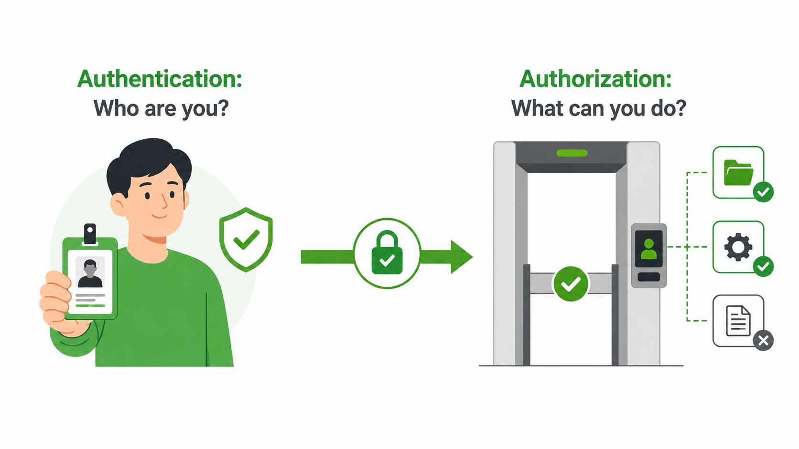
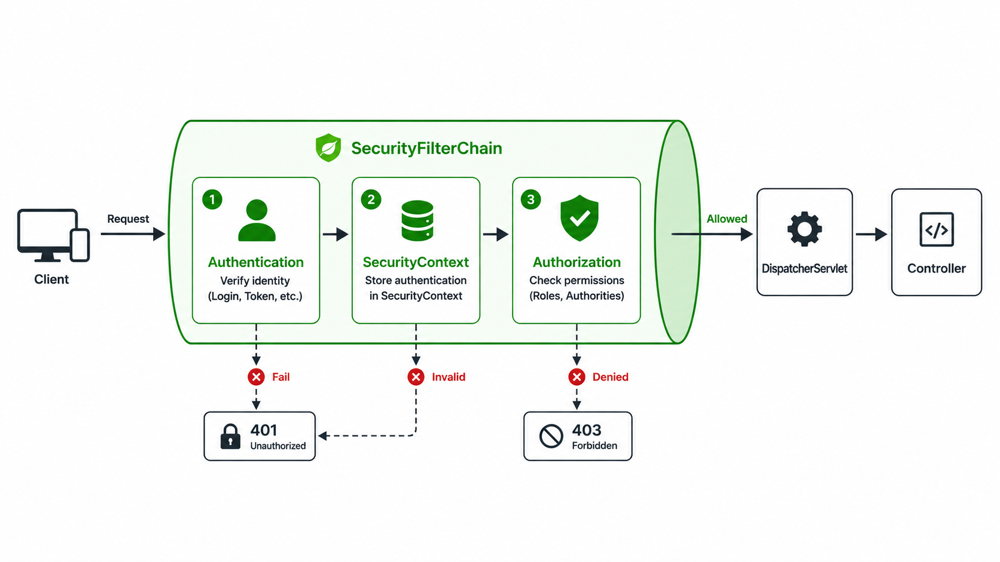
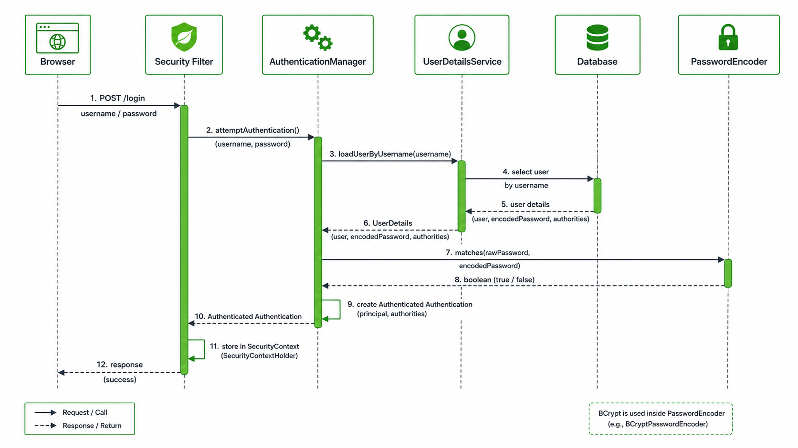
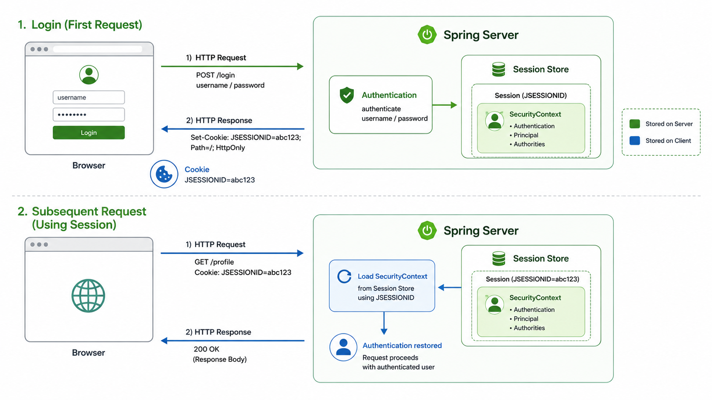
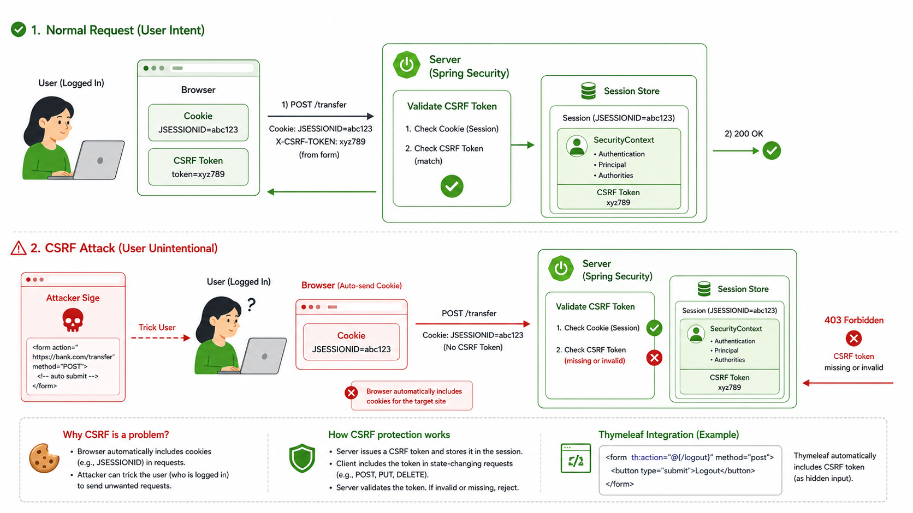
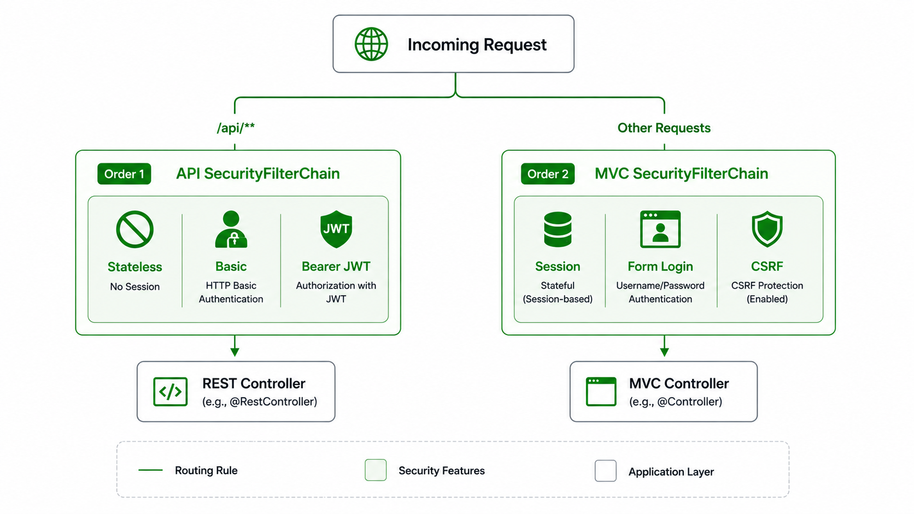
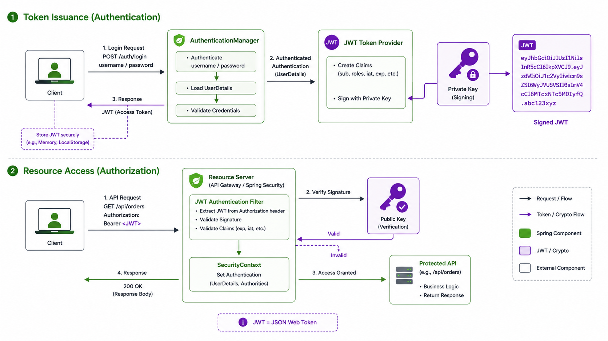

# Spring Security Core

## 공개된 상품 애플리케이션을 안전하게 바꾸기

- 실습 프로젝트: `starter` → `completion`
- 대상: Spring MVC/JPA 기초를 아는 개발자
- Java 21 / Spring Boot 4.1.0

> “현재는 누구나 모든 기능을 사용할 수 있다”

---

# 오늘 해결할 문제

현재 `starter`에는 인증과 인가가 없다.

- 누구나 상품 목록을 조회할 수 있다.
- 누구나 상품을 등록·수정·삭제할 수 있다.
- 모든 REST API가 공개되어 있다.
- 서버는 요청을 보낸 사용자가 누구인지 모른다.

오늘의 목표:

1. 사용자를 인증한다.
2. 사용자 권한에 따라 기능을 제한한다.
3. 웹 화면과 REST API에 적합한 인증 방식을 구분한다.

---

# 실습 애플리케이션 살펴보기

| 영역 | 주요 경로 | 기능 |
|---|---|---|
| MVC | `/` | 홈 |
| MVC | `/product/list` | 상품 목록 |
| MVC | `/product/add` | 상품 등록 |
| MVC | `/product/edit` | 상품 수정 |
| MVC | `/product/delete` | 상품 삭제 |
| API | `/api/version` | 버전 조회 |
| API | `/api/products` | 상품 CRUD |

핵심 질문:

> “누가 어떤 요청을 할 수 있어야 하는가?”

---

# 먼저 보안 요구사항을 정한다

| 기능 | 익명 사용자 | USER | ADMIN |
|---|:---:|:---:|:---:|
| 홈, API 버전 조회 | O | O | O |
| 상품 목록 조회 | X | O | O |
| 상품 등록·수정·삭제 | X | X | O |
| 토큰 발급 요청 | O | O | O |

- 인증(Authentication): 요청한 사용자가 누구인지 확인
- 인가(Authorization): 그 사용자가 요청을 수행할 수 있는지 확인

> completion의 `requestMatchers`는 이 표를 코드로 옮긴 결과

---

# 인증과 인가는 다르다

```text
인증: “당신은 누구입니까?”
      seojun / kwangcheol

인가: “그 일을 할 권한이 있습니까?”
      USER / ADMIN
```

- 로그인 성공은 인증의 끝이다.
- 보호된 기능에 접근하려면 인가 판단이 추가로 필요하다.
- 인증된 사용자도 권한이 부족하면 접근할 수 없다.

### 그림 생성 프롬프트



---

# starter와 completion의 차이

```text
starter
├─ Product
├─ MVC Controller
├─ REST Controller
└─ 모든 요청 공개

completion
├─ Member + MemberRepository
├─ PasswordEncoder
├─ UserDetailsService
├─ MVC SecurityFilterChain
├─ API SecurityFilterChain
├─ 로그인/로그아웃 화면
└─ Basic + JWT 인증
```

보안은 Controller 내부에 `if`를 추가하는 방식이 아니라, 요청 앞단의 공통 보안 계층으로 적용한다.

---

# 1단계: Spring Security 추가

`completion/build.gradle`

```groovy
implementation 'org.springframework.boot:spring-boot-starter-security'
implementation 'org.thymeleaf.extras:thymeleaf-extras-springsecurity6'
implementation 'org.springframework.boot:spring-boot-starter-security-oauth2-resource-server'

testImplementation 'org.springframework.boot:spring-boot-starter-security-test'
```

역할:

- Security Starter: 인증·인가 필터와 기본 보안 구성
- Thymeleaf Extras: 로그인 상태와 권한에 따른 화면 렌더링
- Resource Server: Bearer JWT 검증
- Security Test: 인증 사용자와 권한을 테스트에서 구성

---

# 요청은 Controller보다 먼저 검사된다

```text
Client
  ↓
SecurityFilterChain
  ├─ 인증 정보 추출
  ├─ 사용자 인증
  ├─ SecurityContext 구성
  └─ 접근 권한 확인
  ↓
DispatcherServlet
  ↓
Controller
```

- 인증과 인가는 Servlet Filter 계층에서 처리된다.
- 허용된 요청만 Controller까지 도달한다.
- Controller는 필요할 때 `Authentication`을 주입받아 현재 사용자를 확인한다.

### 그림 생성 프롬프트



---

# 2단계: 인증할 사용자 준비

`Member`

```java
@Entity
public class Member {
    @Id @GeneratedValue
    private Long id;
    private String name;
    private String password;
    private String authority;
}
```

`MemberRepository`

```java
Optional<Member> findByName(String name);
```

- 애플리케이션의 회원 모델과 Spring Security의 인증 모델은 서로 다르다.
- 둘 사이를 연결하는 어댑터가 필요하다.

---

# 패스워드는 평문으로 저장하지 않는다

```java
@Bean
PasswordEncoder passwordEncoder() {
    return new BCryptPasswordEncoder();
}
```

초기 사용자도 인코딩하여 저장한다.

```java
.name("kwangcheol")
.password(passwordEncoder.encode("12345678"))
.authority("ROLE_USER, ROLE_ADMIN")
```

- 저장: 원문 패스워드 → 단방향 해시
- 로그인: 입력값을 같은 방식으로 검증
- 해시 문자열을 다시 원문으로 복호화하지 않는다.

> BCrypt 결과는 같은 패스워드라도 매번 달라질 수 있다. 문자열 동등 비교가 아니라 `PasswordEncoder.matches()`가 필요하다.

---

# UserDetailsService: 회원을 인증 사용자로 변환

```java
@Bean
UserDetailsService userDetailsService(
        MemberRepository memberRepository) {
    return username -> {
        var member = memberRepository.findByName(username)
            .orElseThrow(() ->
                new UsernameNotFoundException(username));

        var authorities = Arrays.stream(member.getAuthorities().split(",")).map(String::trim).toArray(String[]::new);
        
        return User.builder()
                .username(member.getName())
                .password(member.getPassword())
                .authorities(authorities)
                .build();
    };
}
```

- DB에서 회원 조회
- 패스워드 해시와 권한 제공
- Spring Security가 이해하는 `UserDetails`로 변환

---

# 로그인 인증 흐름

```text
username + password
        ↓
AuthenticationManager
        ↓
AuthenticationProvider
   ├─ UserDetailsService → DB 사용자 조회
   └─ PasswordEncoder    → 패스워드 검증
        ↓
authenticated Authentication
        ↓
SecurityContext
```

핵심 객체:

- `Authentication`: 인증 요청 또는 인증 완료 결과
- `AuthenticationManager`: 인증 절차의 진입점
- `SecurityContext`: 현재 요청의 인증 정보 저장소

### 그림 생성 프롬프트



> 16:9 Spring Security 로그인 인증 시퀀스 다이어그램. 왼쪽부터 Browser, Security Filter, AuthenticationManager, UserDetailsService, Database, PasswordEncoder 순서의 세로 생명선. username/password 전달, DB 사용자 조회, BCrypt 검증, authenticated Authentication 반환, SecurityContext 저장 흐름을 화살표로 표현. 흰 배경, Spring 녹색 강조, 전문적인 UML 시퀀스 다이어그램 스타일, 텍스트는 영어 키워드만.

---

# 현재 사용자는 Authentication으로 확인한다

```java
@GetMapping
public String getHome(Authentication authentication) {
    if (authentication != null) {
        log.info("name {}", authentication.getName());
        log.info("authorities {}", authentication.getAuthorities());
    }
    return "home";
}
```

- `getName()`: 인증된 사용자 이름
- `getAuthorities()`: 부여된 권한 목록
- 공개 경로에서는 `authentication == null`일 수 있다.

실습 확인:

1. 로그인 전 홈 요청
2. USER 로그인 후 홈 요청
3. ADMIN 로그인 후 홈 요청
4. 각 요청의 로그 비교

---

# 3단계: MVC 요청 보안

```java
@Bean
@Order(2)
SecurityFilterChain mvcSecurityFilterChain(
        HttpSecurity http) throws Exception {
    return http
        .authorizeHttpRequests(auth -> auth
            .requestMatchers("/").permitAll()
            .requestMatchers("/product/list").authenticated()
            .requestMatchers(
                "/product/add",
                "/product/edit",
                "/product/delete"
            ).hasAuthority("ROLE_ADMIN")
            .anyRequest().authenticated()
        )
        .formLogin(/* ... */)
        .logout(/* ... */)
        .build();
}
```

---

# URL 규칙은 구체적인 것부터 작성한다

```java
.requestMatchers("/").permitAll()
.requestMatchers("/product/list").authenticated()
.requestMatchers("/product/add").hasAuthority("ROLE_ADMIN")
.anyRequest().authenticated()
```

- `permitAll()`: 인증 없이 허용
- `authenticated()`: 로그인한 사용자만 허용
- `hasAuthority("ROLE_ADMIN")`: 정확히 `ROLE_ADMIN` 권한 필요
- `denyAll()`: 항상 거부
- `anyRequest()`: 앞 규칙에 매칭되지 않은 모든 요청

> 첫 번째로 매칭된 규칙이 적용된다. 넓은 규칙을 먼저 두면 뒤의 세부 규칙이 의미를 잃을 수 있다.

---

# 커스텀 로그인과 로그아웃

```java
.formLogin(login -> login
    .loginPage("/login")
    .defaultSuccessUrl("/")
    .permitAll()
)
.logout(logout -> logout
    .logoutUrl("/logout")
    .logoutSuccessUrl("/")
    .permitAll()
)
```

- `GET /login`: 애플리케이션이 로그인 화면을 렌더링
- `POST /login`: Spring Security가 인증 처리
- 로그인 성공 후 인증 정보는 HTTP 세션에 저장
- 로그아웃은 상태 변경이므로 `POST /logout`으로 처리

> 강사 메모: `/login` POST Controller를 직접 만들지 않았는데도 로그인이 처리되는 이유를 질문한다.

---

# 세션 기반 MVC 인증

```text
1. POST /login
2. 사용자 인증 성공
3. 서버 세션에 SecurityContext 저장
4. 브라우저에 JSESSIONID 쿠키 전달
5. 이후 요청마다 쿠키 전송
6. 서버가 세션에서 인증 정보 복원
```

장점:

- 브라우저 기반 MVC 애플리케이션에 자연스럽다.
- 서버에서 세션을 무효화할 수 있다.

고려사항:

- 서버가 세션 상태를 관리한다.
- 여러 서버에서 세션 공유 전략이 필요할 수 있다.

### 그림 생성 프롬프트



---

# CSRF: 세션·쿠키 인증에서 중요한 보호

- 브라우저는 대상 사이트의 쿠키를 요청에 자동으로 포함한다.
- 공격자는 사용자가 로그인한 상태를 악용해 원치 않는 요청을 보낼 수 있다.
- Spring Security는 기본적으로 상태 변경 요청에 CSRF 토큰을 요구한다.
- Thymeleaf의 `th:action`을 사용한 POST 폼에는 CSRF 토큰이 연동된다.

```html
<form th:action="@{/logout}" method="post">
    <button type="submit">로그아웃</button>
</form>
```



---

# 화면에서 권한에 따라 요소 표시

```html
<div sec:authorize="isAuthenticated()">
    <strong sec:authentication="name"></strong>
    <a th:href="@{/logout}">로그아웃</a>
</div>

<a sec:authorize="hasAuthority('ADMIN')"
   th:href="@{/product/add}">
    상품추가
</a>
```

- 익명/로그인 상태에 따라 메뉴 변경
- ADMIN에게만 등록·수정·삭제 링크 표시
- 서버 인가와 화면 표시를 함께 적용

> 화면에서 버튼을 숨기는 것은 보안 경계가 아니다. URL 인가 규칙이 실제 보안을 담당한다.

---

# 인증 실패와 인가 실패

| 상황 | 의미 | MVC의 일반적인 결과 | API의 일반적인 결과 |
|---|---|---|---|
| 미인증 | 사용자를 확인하지 못함 | 로그인 화면으로 이동 | `401 Unauthorized` |
| 권한 부족 | 사용자는 알지만 권한이 없음 | `403 Forbidden` | `403 Forbidden` |

확인 시나리오:

- 익명 사용자가 `/product/list` 접근
- USER가 `/product/add` 접근
- ADMIN이 `/product/add` 접근

> `401`은 “권한 없음”이 아니라 “유효한 인증 정보 없음”에 가깝다.

---

# 4단계: MVC와 API 필터 체인을 분리한다

```java
@Bean
@Order(1)
SecurityFilterChain apiSecurityFilterChain(HttpSecurity http) {
    return http
        .securityMatcher("/api/**")
        // API 보안 설정
        .build();
}

@Bean
@Order(2)
SecurityFilterChain mvcSecurityFilterChain(HttpSecurity http) {
    return http
        // MVC 보안 설정
        .build();
}
```

- `/api/**`는 우선순위 1의 API 체인이 처리한다.
- 나머지 요청은 우선순위 2의 MVC 체인이 처리한다.
- 하나의 요청에는 매칭된 하나의 `SecurityFilterChain`만 적용된다.

### 그림 생성 프롬프트



---

# API는 무상태로 구성한다

```java
.securityMatcher("/api/**")
.csrf(csrf -> csrf.disable())
.sessionManagement(session -> session
    .sessionCreationPolicy(SessionCreationPolicy.STATELESS)
)
.formLogin(form -> form.disable())
.httpBasic(Customizer.withDefaults())
.oauth2ResourceServer(oauth2 ->
    oauth2.jwt(Customizer.withDefaults())
)
```

- API 체인은 서버 세션에 인증 정보를 저장하지 않는다.
- 매 요청이 인증 정보를 직접 포함해야 한다.
- 로그인 HTML 대신 HTTP 상태 코드로 결과를 전달한다.
- 이 예제는 학습을 위해 Basic과 Bearer JWT를 모두 허용한다.

---

# API 접근 정책

```java
.requestMatchers(GET, "/api/version").permitAll()
.requestMatchers(GET, "/api/products").authenticated()
.requestMatchers(POST, "/api/products")
    .hasAnyAuthority("ROLE_ADMIN", "SCOPE_ROLE_ADMIN")
.requestMatchers(PUT, "/api/products/*")
    .hasAnyAuthority("ROLE_ADMIN", "SCOPE_ROLE_ADMIN")
.requestMatchers(DELETE, "/api/products/*")
    .hasAnyAuthority("ROLE_ADMIN", "SCOPE_ROLE_ADMIN")
.requestMatchers(POST, "/api/tokens").permitAll()
.anyRequest().denyAll()
```

`anyRequest().denyAll()`은 허용 목록 방식(allowlist)이다.

- 정의한 API만 외부에 노출한다.
- 새 API를 추가하면 보안 정책도 명시적으로 추가해야 한다.
- 예상하지 못한 경로가 자동으로 공개되지 않는다.

---

# HTTP Basic Authentication 동작 방식

HTTP Basic Authentication은 사용자 이름(username)과 비밀번호(password)를 username:password 형식으로 결합한 뒤 Base64로 인코딩하여 HTTP 헤더에 포함하는 인증 방식

> 예) Authorization: Basic dXNlcjoxMjM0

# Basic Authentication으로 먼저 확인

```bash
# 공개 API
curl -i http://localhost:8080/api/version

# 인증 없이 상품 조회: 401
curl -i http://localhost:8080/api/products

# USER로 상품 조회: 200
curl -i -u seojun:12345678 \
  http://localhost:8080/api/products

# USER로 상품 등록: 403
curl -i -u seojun:12345678 \
  -H "Content-Type: application/json" \
  -d '{"name":"Keyboard","price":50000}' \
  http://localhost:8080/api/products
```

- Basic 인증은 매 요청에 사용자 이름과 패스워드를 전달한다.
- 반드시 HTTPS와 함께 사용해야 한다. Base64는 암호화 방식이 아니다.
- 인증 파이프라인과 인가 규칙을 빠르게 검증하기 좋다.

---

# 5단계: 패스워드 대신 JWT 전달

```text
최초 1회
username + password → 인증 → JWT 발급

이후 요청
Authorization: Bearer <JWT> → 서명 검증 → API 접근
```

JWT가 담는 대표 정보:

- `sub`: 사용자 식별자
- `scope`: 권한 범위
- `iat`: 발급 시각
- `exp`: 만료 시각
- `iss`: 발급자

JWT는 암호화된 비밀 상자가 아니라, 위변조 여부를 검증할 수 있는 서명된 데이터다.

---

# JWT 토큰 발급

```java
Authentication authentication =
    authenticationManager.authenticate(
        new UsernamePasswordAuthenticationToken(
            request.getUsername(),
            request.getPassword()
        )
    );

String scope = authentication.getAuthorities().stream()
    .map(GrantedAuthority::getAuthority)
    .collect(Collectors.joining(" "));
```

중요한 설계:

- 토큰 발급에서도 기존 `AuthenticationManager`를 재사용한다.
- 폼 로그인과 JWT 발급이 같은 사용자 조회·패스워드 검증 방식을 사용한다.
- 인증 성공 후 권한을 `scope` 클레임으로 만든다.

---

# JWT 클레임과 서명

```java
JwtClaimsSet claims = JwtClaimsSet.builder()
    .issuer("self")
    .issuedAt(Instant.now())
    .expiresAt(Instant.now().plusSeconds(3600))
    .subject(authentication.getName())
    .claim("scope", scope)
    .build();

return encoder.encode(
    JwtEncoderParameters.from(claims)
).getTokenValue();
```

- 개인키: 서버가 JWT에 서명
- 공개키: Resource Server가 JWT 서명을 검증
- 토큰 수명: 예제에서는 1시간

```yaml
jwt:
  private:
    key: file:${user.home}/.jwt/app.key
  public:
    key: file:${user.home}/.jwt/app.pub
```

---

# JWT 인증 흐름

```text
POST /api/tokens
  credentials
      ↓
AuthenticationManager
      ↓
JwtEncoder + Private Key
      ↓
signed JWT

GET/POST /api/products
  Authorization: Bearer JWT
      ↓
JwtDecoder + Public Key
      ↓
JwtAuthenticationToken
      ↓
Authorization
```

### 그림 생성 프롬프트



---

# `ROLE_ADMIN`과 `SCOPE_ROLE_ADMIN`은 왜 다른가?

DB 사용자 권한:

```text
ROLE_ADMIN
```

Basic/Form 인증 결과:

```text
GrantedAuthority = ROLE_ADMIN
```

JWT의 `scope` 클레임:

```json
{ "scope": "ROLE_ADMIN" }
```

Resource Server 변환 결과:

```text
GrantedAuthority = SCOPE_ROLE_ADMIN
```

그래서 API 쓰기 권한은 다음 둘을 허용한다.

```java
.hasAnyAuthority("ROLE_ADMIN", "SCOPE_ROLE_ADMIN")
```

---

# JWT API 실습

```bash
# ADMIN 계정으로 토큰 발급
curl -X POST http://localhost:8080/api/tokens \
  -H "Content-Type: application/json" \
  -d '{"username":"kwangcheol","password":"12345678"}'
```

```bash
# 발급받은 토큰으로 상품 조회
curl -i http://localhost:8080/api/products \
  -H "Authorization: Bearer <TOKEN>"
```

```bash
# ADMIN 토큰으로 상품 등록
curl -i -X POST http://localhost:8080/api/products \
  -H "Authorization: Bearer <TOKEN>" \
  -H "Content-Type: application/json" \
  -d '{"name":"Keyboard","price":50000}'
```

확인할 것:

- 잘못된 패스워드 → 토큰 발급 `401`
- 만료·변조 토큰 → API 요청 `401`
- USER 토큰으로 등록 → `403`

---

# 완성본의 전체 구조

```text
Browser ── Form Login / Session ──┐
                                  ├─ SecurityFilterChain
API Client ─ Basic or Bearer JWT ─┘
                   ↓
          UserDetailsService
                   ↓
            MemberRepository
                   ↓
              H2 Database
```

| 구분 | MVC | API |
|---|---|---|
| 인증 방식 | Form Login | Basic / Bearer JWT |
| 상태 | Stateful Session | Stateless |
| 실패 응답 | 로그인 이동 / 403 | 401 / 403 |
| CSRF | 기본 활성화 | 비활성화 |
| 적용 대상 | API 외 요청 | `/api/**` |

---

# 권장 실습 진행 순서

1. starter 실행 및 공개된 기능 확인
2. 보안 요구사항 표 작성
3. Security Starter 추가 후 기본 보안 동작 확인
4. `Member`, `MemberRepository` 추가
5. `PasswordEncoder`, 초기 사용자 추가
6. `UserDetailsService` 연결
7. 단일 MVC `SecurityFilterChain` 작성
8. 커스텀 로그인·로그아웃 구현
9. Thymeleaf 권한별 UI 적용
10. API 체인 분리와 `STATELESS` 적용
11. Basic 인증으로 API 정책 검증
12. JWT Encoder/Decoder와 토큰 발급 구현
13. Bearer JWT로 API 호출
14. 누락된 단건 조회 규칙을 찾아 수정

> 각 단계마다 “성공 경로”뿐 아니라 익명, 잘못된 비밀번호, 권한 부족 요청도 확인한다.

---

# 테스트 체크리스트

| 사용자 | 요청 | 기대 결과 |
|---|---|---|
| 익명 | `GET /` | 200 |
| 익명 | `GET /product/list` | 로그인 페이지 이동 |
| USER | `GET /product/list` | 200 |
| USER | `GET /product/add` | 403 |
| ADMIN | `GET /product/add` | 200 |
| 익명 | `GET /api/version` | 200 |
| 익명 | `GET /api/products` | 401 |
| USER Basic/JWT | `GET /api/products` | 200 |
| USER Basic/JWT | `POST /api/products` | 403 |
| ADMIN Basic/JWT | `POST /api/products` | 성공 |
| 변조된 JWT | `GET /api/products` | 401 |

테스트의 목적은 “로그인이 된다”가 아니라 보안 정책 전체가 유지되는지 검증하는 것이다.

---

# 핵심 정리

1. 인증은 사용자 확인, 인가는 권한 판단이다.
2. Spring Security는 Controller 앞의 Filter Chain에서 요청을 보호한다.
3. `UserDetailsService`와 `PasswordEncoder`가 애플리케이션 회원을 인증 시스템에 연결한다.
4. MVC는 Form Login + Session, API는 Stateless 인증이 자연스럽다.
5. 여러 `SecurityFilterChain`은 matcher와 order로 적용 범위를 분리한다.
6. 화면에서 버튼을 숨겨도 서버 URL 인가는 반드시 필요하다.
7. JWT는 서명된 토큰이며, 만료·키 관리·HTTPS가 필요하다.
8. `denyAll()` 기반 allowlist는 안전하지만 새 경로를 추가할 때 정책도 함께 갱신해야 한다.

---

# 다음 학습 주제

- `spring-security-test`를 이용한 MVC/API 인가 테스트
- 예외 응답 형식 통일: `AuthenticationEntryPoint`, `AccessDeniedHandler`
- 메서드 보안: `@PreAuthorize`
- CORS와 CSRF의 차이
- Refresh Token과 토큰 폐기 전략
- OAuth 2.0 Authorization Server 분리
- 역할 계층과 권한 모델 설계
